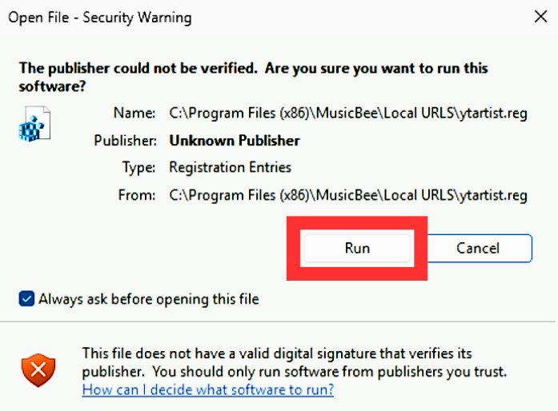
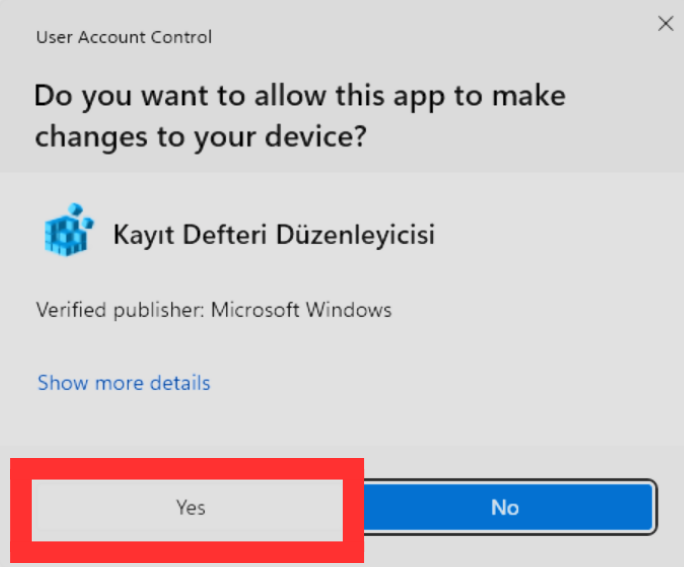

# MusicBee-YouTube-Artist_URL-Parameter

Warning: This repository was built entirely using AI.

Required parameter for MusicBee: `ytartist:<Artist>`

## Setup

1. unzip `Local.URLS.zip`
2. Copy the `Local URLS` folder from the `Local.URLS\Local URLS2` directory.
3. Go to the directory where MusicBee is installed.
   *To avoid issues during the process, if you are using Windows 10, right-click the MusicBee folder, then click Properties, open the Security tab, and finally click the Edit button next to "To change permissions, click Edit." If you are using Windows 11, right-click the MusicBee folder, click Show more options, then click  Properties, open the Security tab, and finally click the Edit button next to "To change permissions, click Edit."
5. Paste the copied `Local URLS` folder into the directory where MusicBee is installed.
6. Open the Local URLS directory.
7. Windows 10: Right-click the ytartist.reg file and select Edit in Notepad. Windows 11: Right-click the ytartist.reg file, click Show more options, then select Edit in Notepad.
8. Edit the following code in the ytartist.reg file:
```reg
Windows Registry Editor Version 5.00

[HKEY_CLASSES_ROOT\ytartist]
@="URL:YouTube Artist"
"URL Protocol"=""

[HKEY_CLASSES_ROOT\ytartist\DefaultIcon]
@="C:\\Path\\To\\YouTubeRedirect.exe,0"

[HKEY_CLASSES_ROOT\ytartist\shell]

[HKEY_CLASSES_ROOT\ytartist\shell\open]

[HKEY_CLASSES_ROOT\ytartist\shell\open\command]
@="\"C:\\Path\\To\\YouTubeRedirect.exe\" \"%1\""
``` 


8. Replace `C:\\Path\\To\\YouTubeRedirect.exe` with the full path to `YouTubeRedirect.exe` inside your MusicBee `Local URLS` folder.
   Example:
  `C:\\Program Files (x86)\\MusicBee\\Local URLS\\YouTubeRedirect.exe`

9. Save the ytartist.reg file using ANSI encoding.
10. Double-click the ytartist.reg file, then click the "Run" button in the warning dialog that appears:



11. When the UAC prompt appears, click "Yes":


